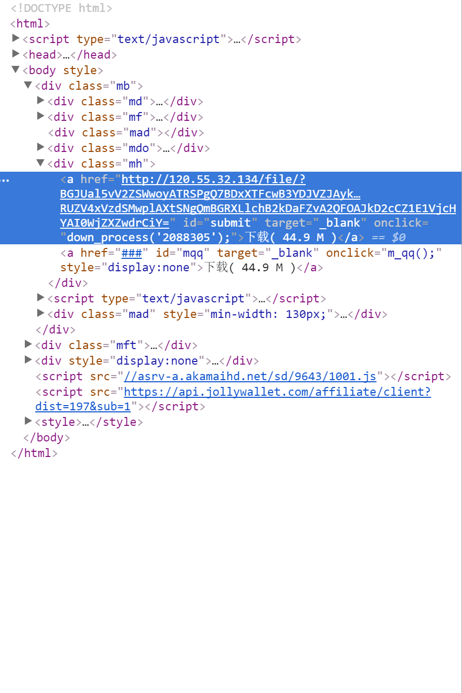

# 关于蓝奏云直链解析的个人研究

如果你要建一个提供下载服务的网站，那么你提供的下载的内容就必定要存到一个服务器上。但是如果你没有足够的能力来自己搭建或租赁一台服务器的话，通过直链解析来提供下载服务那就是最好不过了。
我的blog（```memset0.scris.top```）身为一个轻量级的博客网站，我建站的初衷就是为了**什么都不花钱**（滑稽），所以我不得不找到一个能用且好用的直链网盘。

现在市场上的直链网盘有很多，但是大都不尽人意。不是因为太贵就是限制太多，百度云的直链解析前不久又被封掉了，找了两天都没有找到一个合适的。然后我就决定自己想办法。

在这之前，我找到了一个叫做```蓝奏云```的网盘，这个网盘不限空间不限流量不限速度（至少他是这么宣称的，实际使用起来嘛：呵呵），单个文件**限制在100MB以内**，有限制文件后缀名（不过你可以压缩成分卷rar）。但是目前只提供外链服务。之前，我的blog里的内容下载接的都是```蓝奏云```的外链。但这不是就和打广告一样吗？而且让我怎么在同学面前说（zhuang）它（bi）呢？

然后我就要想办法解析它的外链，你上网百度的一堆目前不是要你下载别人编译好的程序的就是被和谐的，你看了也没有什么luan用。所以还是要自食其力啊。
根据F12实践，下载页面的链接已经**不是直链**，是已经再解析过的临时链接，不能使用。

**那怎么办？**
百折不挠的我找到了一个办法，那就是能不能伪装成手机的UA，然后套出直链来呢？说干就干！下载```UA Switch for Chrome```，选择```Android```的UA。
从```https://pan.lanzou.com/i07qbgf```转入```https://pan.lanzou.com/tp/i07qbgf```。然后check下载按钮...



我发现了什么？直链啊直链！

赶紧更新blog源码，push到```coding```，等待部署，刷新页面...


yeah！

可以使用！

...

个鬼啊！


过了一会儿就Error了

tmd是逗我么。。。

The End